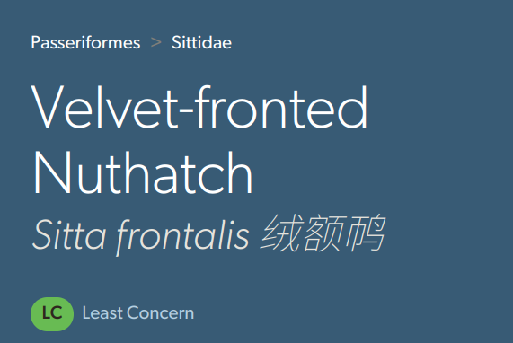

# Add Extra Names for eBird Pages(especially Chinese Name)

# eBird中文注名
在eBird图鉴网站中的学名后加注中文名，使用 IOC 14.1

[Source Code on Github](https://github.com/ljk5403/eBirdExtraNames)

## 安装：

1. 浏览器安装 [Tampermonkey](https://www.tampermonkey.net/), 手机浏览器推荐使用 [Firefox](https://www.mozilla.org/en-US/firefox/browsers/mobile/android/) 或者 [Via](https://viayoo.com/zh-cn/)
2. 转到 [Greasyfork](https://greasyfork.org/en/scripts/495909-ebird-add-chinese-name-near-scientific-name) 网站，选择 "Install this script" 安装
3. 访问任意 eBird 图鉴网站测试，如 [Velvet-fronted Nuthatch/绒额䴓](https://ebird.org/species/vefnut1/L1987536)

## Bird List

Bird list from: <https://www.worldbirdnames.org/new/ioc-lists/master-list-2/> "Multilingual Version (v14.1, Excel file XLSX, 7.8Mb)"
